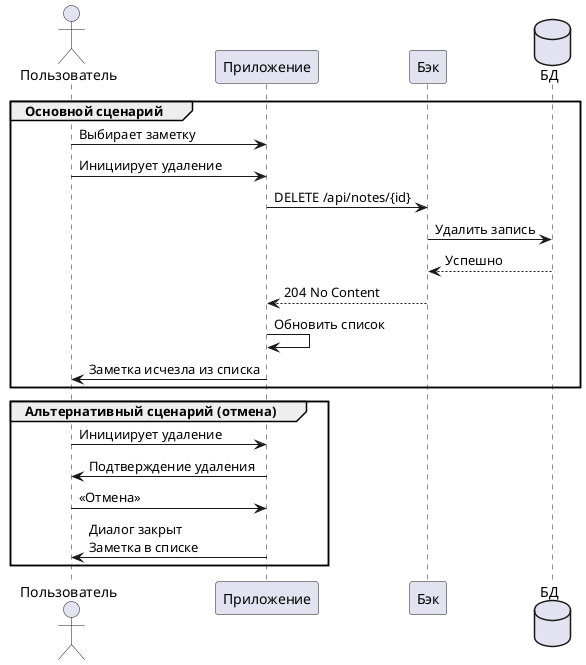

# 🗑️ Удаление заметки

**Действующие лица:**

1. Пользователь  
1. Приложение  
1. Бэк  
1. База данных  

**Предварительные условия**

1. Пользователь должен находиться на главном экране.  
1. В списке заметок должна быть хотя бы одна запись.

**Выходные условия** 

Система удаляет данные о заметке и больше не отображает её в списке.

**Основной сценарий**

1. Пользователь выбирает заметку из списка.  
1. Пользователь инициирует удаление (например, свайпом или через меню).  
1. Приложение отправляет запрос Бэку на удаление заметки: `DELETE http://notesapp.su/api/notes`.  
1. Бэк удаляет запись из Базы данных.  
1. Бэк возвращает Приложению ответ об успешном удалении: `204 Заметка успешно удалена`.  
1. Приложение обновляет список заметок — удалённая заметка исчезает.

**Альтернативный сценарий**  

1. Пользователь выбирает заметку из списка.  
1. Пользователь инициирует удаление.  
1. Приложение показывает подтверждение удаления.  
1. Пользователь нажимает «Отмена».  
1. Приложение закрывает диалог подтверждения.  
1. Заметка остаётся в списке без изменений.

**Диаграмма последовательности**



??? note "Код диаграммы"
    ```plantuml

    @startuml
    actor Пользователь
    participant Приложение
    participant Бэк
    database БД

    group Основной сценарий
    Пользователь -> Приложение: Выбирает заметку
    Пользователь -> Приложение: Инициирует удаление
    Приложение -> Бэк: DELETE /api/notes/{id}
    Бэк -> БД: Удалить запись
    БД --> Бэк: Успешно
    Бэк --> Приложение: 204 No Content
    Приложение -> Приложение: Обновить список
    Приложение -> Пользователь: Заметка исчезла из списка
    end

    group Альтернативный сценарий (отмена)
    Пользователь -> Приложение: Инициирует удаление
    Приложение -> Пользователь: Подтверждение удаления
    Пользователь -> Приложение: «Отмена»
    Приложение -> Пользователь: Диалог закрыт\nЗаметка в списке
    end
    @enduml

    ```