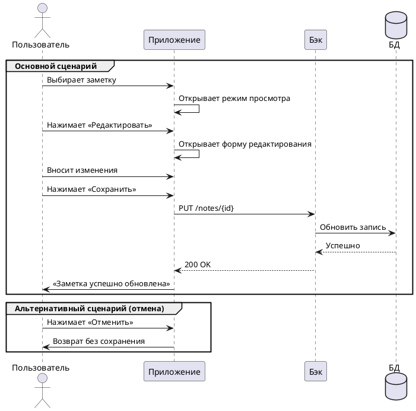

# ✏️ Редактирование заметки

**Действующие лица**

1. Пользователь  
1. Приложение  
1. Бэк  
1. База данных  

**Предварительные условия**  

1. Пользователь должен находиться на главном экране.  
2. В системе должна существовать заметка для редактирования.

**Выходные условия**  

Система сохраняет изменения в существующей заметке.

**Основной сценарий**

1. Пользователь выбирает заметку из списка.  
2. Приложение открывает заметку в режиме просмотра.  
3. Пользователь нажимает кнопку «Редактировать».  
4. Приложение открывает форму редактирования с текущим содержимым заметки.  
5. Пользователь вносит изменения в текст.  
6. Пользователь нажимает кнопку «Сохранить».  
7. Приложение отправляет обновлённые данные Бэку.  
8. Бэк обновляет запись в Базе данных.  
9. Бэк возвращает Приложению ответ об успешном обновлении.  
10. Приложение открывает пользователю уведомление «Заметка успешно обновлена».

**Альтернативный сценарий**

1. Пользователь выбирает заметку из списка.  
2. Приложение открывает заметку в режиме просмотра.  
3. Пользователь нажимает кнопку «Редактировать».  
4. Приложение открывает форму редактирования.  
5. Пользователь вносит изменения.  
6. Пользователь нажимает кнопку «Отменить».  
7. Приложение возвращает пользователя на экран просмотра без сохранения изменений.

**Диаграмма последовательности**



??? note "Код диаграммы"
    ```plantuml

    @startuml
    actor Пользователь
    participant Приложение
    participant Бэк
    database БД

    group Основной сценарий
      Пользователь -> Приложение: Выбирает заметку
      Приложение -> Приложение: Открывает режим просмотра
      Пользователь -> Приложение: Нажимает «Редактировать»
      Приложение -> Приложение: Открывает форму редактирования
      Пользователь -> Приложение: Вносит изменения
      Пользователь -> Приложение: Нажимает «Сохранить»
      Приложение -> Бэк: PUT /notes/{id}
      Бэк -> БД: Обновить запись
      БД --> Бэк: Успешно
      Бэк --> Приложение: 200 OK
      Приложение -> Пользователь: «Заметка успешно обновлена»
    end

    group Альтернативный сценарий (отмена)
      Пользователь -> Приложение: Нажимает «Отменить»
      Приложение -> Пользователь: Возврат без сохранения
    end
    @enduml

    ```